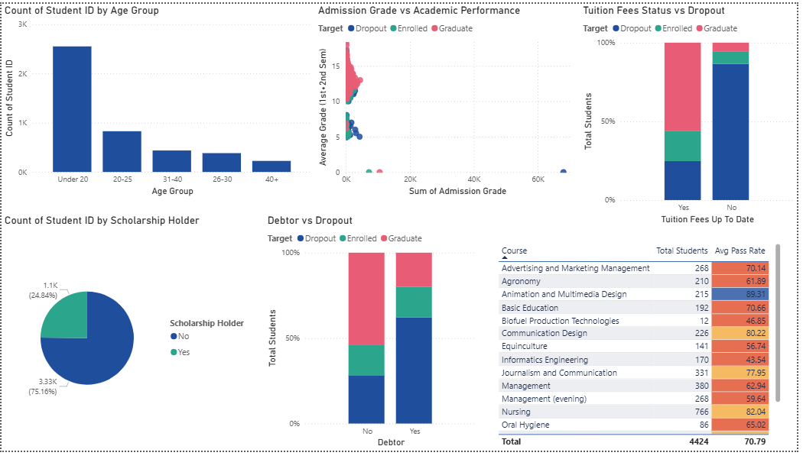

# 🎓 Student Enrollment Dashboard

An interactive **Power BI Dashboard** developed to analyze student enrollment, academic performance, and student demographics. This project transforms raw student data into meaningful insights through interactive visualizations and Key Performance Indicators (KPIs).

## 📌 Project Overview

The **Student Enrollment Dashboard** helps educational institutions monitor student enrollment, analyze academic performance, and understand demographic trends. The dashboard provides an intuitive interface for exploring data using filters, charts, and KPIs.

## 🎯 Objectives

* Analyze student enrollment data.
* Monitor academic performance.
* Visualize demographic distribution.
* Track scholarship students.
* Generate meaningful insights for better decision-making.

## 🛠️ Tools & Technologies

* Microsoft Power BI
* Power Query
* DAX (Data Analysis Expressions)
* Microsoft Excel


## 📊 Dashboard Features

### 📌 Overview Dashboard

* 👨‍🎓 Total Students
* 📝 Total Enrollment
* 📚 Average Grade
* ✅ Overall Pass Rate
* 🎓 Scholarship Students
* Interactive KPI Cards
* Dynamic Filters and Slicers

### 📌 Performance Dashboard

* Course-wise Student Distribution
* Gender Distribution
* Age Analysis
* Nationality Analysis
* Academic Performance Analysis
* Interactive Charts and Visualizations


## 📈 Key Insights

* Overall student enrollment statistics.
* Academic performance analysis.
* Department and course comparison.
* Gender and nationality distribution.
* Scholarship student analysis.
* Interactive filtering for detailed exploration.

## 📂 Dataset Information

The dataset includes:

* Student ID
* Gender
* Age at Enrollment
* Nationality
* Course
* Admission Grade
* Average Grade
* Scholarship Holder
* Tuition Fee Status
* Debtor Status
* Overall Pass Rate

## 📷 Dashboard Preview

### 📌 Overview Dashboard


### 📌 Performance Dashboard



## 🚀 How to Run the Project

1. Clone or download this repository.
2. Open **Student_Enrollment_Dashboard.pbix** using Microsoft Power BI Desktop.
3. Refresh the dataset if required.
4. Explore the dashboard using the available filters and slicers.

## 📁 Repository Structure

```text
student-enrollment-dashboard/
│
├── Student_Enrollment_Dashboard.pbix
├── Student_Enrollment_Dataset.xlsx
├── overview.png
├── performance.png
└── README.md
```

---

## 💡 Skills Demonstrated

* Data Cleaning
* Data Transformation
* Data Modeling
* DAX Measures
* Data Visualization
* Dashboard Design
* Business Intelligence
* Analytical Thinking

---

## 👩‍💻 Developed By

**Sowmiya**

B.Sc. Computer Science with Data Analytics

Dr. N.G.P. Arts and Science College

---

## ⭐ If you like this project

If you found this project useful, please consider giving this repository a **⭐ Star**.
